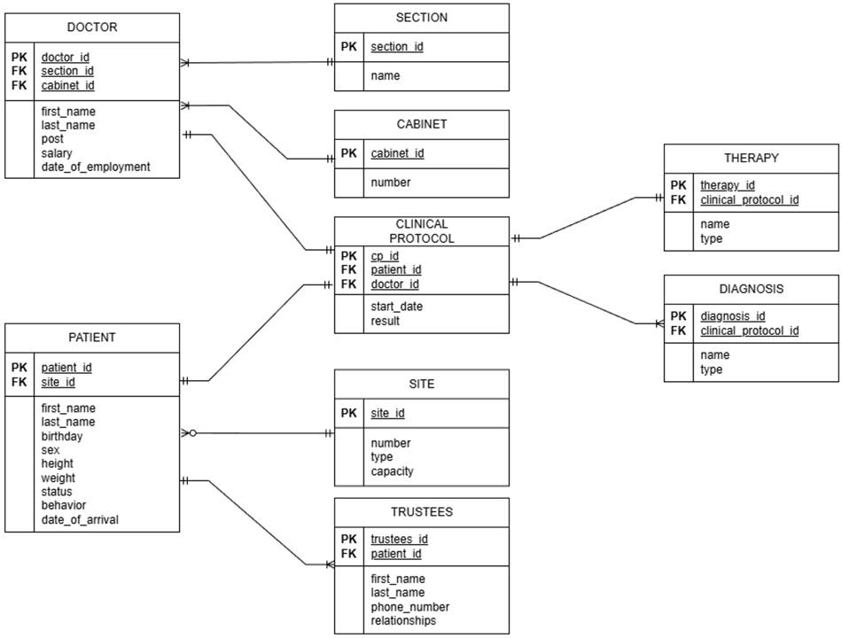

# Проектування бази даних «Система керування психлікарні»

## Мета системи
Дана система призначена для керування лікуванням пацієнтів 
психлікарні або в палатах, або в ізоляторах (різні місця перебування). 
Лікарі проводять огляд пацієнтів, на основі чого вони скаладають клінічний 
протокол, в якому йдеться мова про діагноз(и) пацієнту та методи лікування. 
Система також передбачає ведення обліку довірених осіб пацієнтів.
 

## Ключові елементи даних
Пацієнти мають проходити мед. огляд від лікаря та проходять лікування у
певних місцях перебування.

Лікарі проводять мед. огляд та складають медичний протокол.

## Дані для зберігання
Секції (або ж відділення - локація, де містяться місця перебування)

Кабінети лікарів

Клінічні протоколи

Місця перебування

Довірені особи

Задокументована терапія

Список діагнозів

## Бізнес-правила
Лікар складає перебуває у своєму кабінеті та складає медичний протокол. Він
назначений на певний відділ.

Пацієнт надає дані про себе для складання медичного протоколу. Пацієнт
перебуває в 1 з 2-х місць перебувань та може мати довірених осіб.

Клінічний протокол, який складає лікар, містить в собі діагноз(и) та терапію
для лікування конкретного пацієнту.

Діагноз (або декілька) може(уть) бути встановлений(і) лікарем.

Терапія містить в собі рекомендації лікаря щодо лікування пацієнту.

Місця перебування бувають 2-х типів: палати та ізолятори, які відрізняються
один від одного кількістю місць.

У певного пацієнта можуть бути довірені особи, які заповнюють дані пацієнта
та отримують інформацію щодо його стану.

## ER діаграма

## Сутності та їх атрибути

### DOCTOR
Займається лікуванням пацієнтів.

**Атрибути:**
- `doctor_id` (PK) - ідентифікатор лікаря
- `section_id` (FK) - посилання на відділення
- `cabinet_id` (FK) - посилання на кабінет
- `first_name` - ім'я
- `last_name` - прізвище
- `post` - посада лікаря
- `salary` - зарплатня лікаря
- `date_of_employment` - дата прийому на роботу

**Зв'язки:**
- Лікар працює в 1 кабінеті
- Лікар прив'язаний до одного відділення
- Лікар складає 1 медичний протокол на основі 1 пацієнта

---

### PATIENT
Проходить курс лікування в психлікарні.

**Атрибути:**
- `patient_id` (PK) - ідентифікатор пацієнта
- `site_id` (FK) - посилання на місце перебування
- `first_name` - ім'я
- `last_name` - прізвище
- `birthday` - день народження
- `sex` - стать
- `height` - ріст
- `weight` - вага
- `status` - стан
- `behavior` - поведінка (агресивна/пасивна/...)
- `date_of_arrival` - дата прибуття

**Зв'язки:**
- Пацієнт надає дані лікарю для 1 клінічного протоколу
- Пацієнт прив'язаний до певного місця перебування
- Пацієнт може мати 1 або декілька відповідальних осіб

---

### SECTION
Відділення, в якому можуть розміщуватися декілька місць перебування.

**Атрибути:**
- `section_id` (PK) - ідентифікатор відділення
- `name` - назва відділення

**Зв'язки:**
- В певному відділенні може працювати різна кількість лікарів

---

### CABINET
Кабінет лікаря

**Атрибути:**
- `cabinet_id` (PK) - ідентифікатор кабінета
- `number` - номер кабінета

**Зв'язки:**
- В певному кабінеті можуть працювати кілька лікарів

---

### CLINICAL PROTOCOL
Документ, що складається лікарем, на основі стану пацієнта

**Атрибути:**
- `cp_id` (PK) - ідентифікатор клінічного протоколу
- `patient_id` (FK) - посилання на пацієнта
- `doctor_id` (FK) - посилання на лікаря
- `start_date` - дата початку лікування
- `result` - результат

**Зв'язки:**
- Клінічний протокол складає 1 лікар
- Клінічний протокол описує 1 пацієнта

---

### SITE
Місце перебування пацієнта

**Атрибути:**
- `site_id` (PK) - ідентифікатор місця перебування
- `number` - номер
- `type` - тип (палата/ізолятор)
- `capacity` - місткість

**Зв'язки:**
- В певному місці перебуванні можуть бути кілька пацієнтів (а може нікого)

---

### TRUSTEES
Довірені особи певного пацієнта

**Атрибути:**
- `trustees_id` (PK) - ідентифікатор довіреної особи
- `patient_id` (FK) - посилання на пацієнта
- `first_name` - ім'я
- `last_name` - прізвище
- `phone_number` - номер телефону
- `relationships` - тип відносин (батько/мати/сестра/брат/...)

**Зв'язки:**
- Може бути кілька довірених осіб у 1 пацієнта

---

### THERAPY
Детально розписаний шлях лікування пацієнта

**Атрибути:**
- `therapy_id` (PK) - ідентифікатор терапії
- `clinicl_protocol_id` (FK) - посилання на клінічний протокол
- `name` - назва
- `type` - тип (медикаментозна/психотерапія/групова)

**Зв'язки:**
- Терапія назначається на основі клінічного протоколу

---

### DIAGNOSIS
Діагноз(и) які описують недуги пацієнта

**Атрибути:**
- `diagnosis_id` (PK) - ідентифікатор діагнозу
- `clinical_protocol_id` (FK) - посилання на клінічний протокол
- `name` - назва
- `type` - тип (попередній/диференціальний/заключний)

**Зв'язки:**
- діагноз(и) оголошений(і) на основі змісту клінічного протоколу
