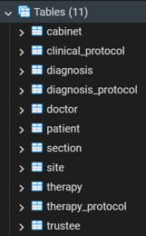
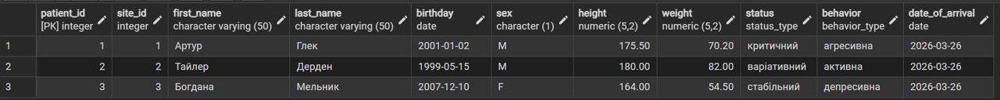

# Лабораторна робота №2
## Перетворення ER-діаграми у реляційну схему PostgreSQL

---

## Мета роботи

Метою даної лабораторної роботи є створення кожної таблиці з ERD
у реляційну схему та її реалізація у СУБД PostgreSQL

---

## Опис

База даних призначена для автоматизації обліку в медичному закладі (психіатричній лікарні). 
Вона дозволяє структурувати дані про внутрішній устрій закладу, персонал та процес лікування.

Система дозволяє:
- зберігати структуру закладу (відділення, кабінети, стаціонарні ділянки),
- вести реєстр лікарів та закріплювати їх за підрозділами,
- реєструвати пацієнтів, їхні фізичні параметри та довірених осіб,
- формувати клінічні протоколи лікування,
- пов'язувати протоколи з конкретними діагнозами та методами терапії.

---

## Реляційна схема бази даних

- Section (section_id, name)
- Site (site_id, section_id, number, type, capacity)
- Cabinet (cabinet_id, section_id, number, capacity)
- Doctor (doctor_id, cabinet_id, section_id, first_name, last_name, post, salary, date_of_employment)
- Patient (patient_id, site_id, first_name, last_name, birthday, sex, height, weight, status, behavior, date_of_arrival)
- Trustee (trustee_id, patient_id, first_name, last_name, phone_number, relationships)
- Clinical_Protocol (clinical_protocol_id, patient_id, doctor_id, start_date, result)
- Diagnosis (diagnosis_id, name, type)
- Diagnosis_Protocol (diagnosis_protocol_id, diagnosis_id, clinical_protocol_id)
- Therapy (therapy_id, name, type)
- Therapy_Protocol (therapy_protocol_id, therapy_id, clinical_protocol_id)

---

## Основні звʼязки між таблицями

- Одне Section (Відділення) може містити багато Site (Дільниць) та Cabinet (Кабінетів).
- В одному Cabinet (Кабінеті) може працювати кілька Doctor (Лікарів).
- Одна Site (Дільниця/Палата) призначена для перебування багатьох Patient (Пацієнтів).
- Один Patient (Пацієнт) може мати одну або декілька Trustee (Довірених осіб/родичів).
- Один Doctor (Лікар) може бути відповідальним за багато Clinical Protocol (Клінічних протоколів).
- Один Patient (Пацієнт) може проходити лікування за декількома Clinical Protocol (Клінічними протоколами) протягом історії хвороби.
- Один Clinical Protocol (Клінічний протокол) може включати декілька Diagnosis (Діагнозів) через таблицю сполучення Diagnosis_Protocol.
- Один Clinical Protocol (Клінічний протокол) може передбачати декілька видів Therapy (Терапії) через таблицю сполучення Therapy_Protocol.

Усі звʼязки типу `1:N` реалізовані за допомогою зовнішніх ключів.

---

## Користувацькі типи даних (ENUM)

Для підвищення цілісності даних у PostgreSQL використано перелічувані типи:

- `room_type`: 'ізолятор', 'палата'
- `status_type`: 'стабільний', 'критичний', 'варіативний'
- `behavior_type`: 'адекватна', 'депресивна', 'агресивна', 'пасивна', 'активна'
- `relationship_type`: 'мати', 'батя', 'брат', 'сестра', 'інші'
- `result_type`: 'одужання', 'без змін', 'летальний наслідок', 'покращення', 'погіршення'

---

## Обмеження цілісності
- CHECK на місткість (Site): Суворе правило, за яким ізолятор завжди має місткість 1 ліжко, а палата — 4.
- CHECK на зарплату та параметри пацієнта: Всі числові значення (salary, height, weight) повинні бути строго більшими за нуль.
- ON DELETE CASCADE: Використовується для таблиці `trustee`, щоб при видаленні пацієнта автоматично видалялися дані про його родичів.

---

## Реалізація у PostgreSQL

Скрипт був виконаний у pgAdmin 4 (база працює в Docker-контейнері). Код розбито на логічні блоки:
- очищення: Видалення існуючих таблиць через DROP TABLE ... CASCADE.
- DDL: Створення таблиць з визначенням PK, FK та CHECK-констрейнтів.
- DML: Вставка тестових даних (по 3-5 записів для кожної сутності).

---

## Тестування

Для перевірки коректності створення схеми було виконано:
- створення всіх типів і таблиць у PostgreSQL (Docker-контейнер)

- додавання **не менше 3 тестових записів у кожну таблицю**

- перевірка заповнення таблиць через запит SELECT * FROM patient;

Усі SQL-скрипти виконуються без помилок.

---

## Висновки

У результаті виконання лабораторної роботи:
- ER-діаграма була успішно трансформована у реляційну модель;
- створено 11 взаємопов'язаних таблиць та 5 користувацьких типів даних;
- реалізовано механізми автоматичного контролю за цілісністю даних (CHECK, UNIQUE, NOT NULL);
- схема успішно розгорнута та протестована у СУБД PostgreSQL через Docker.
