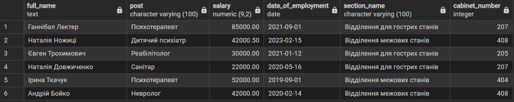
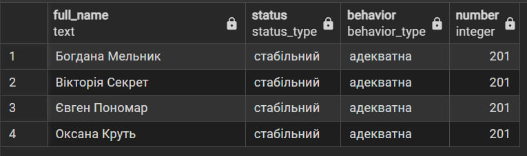
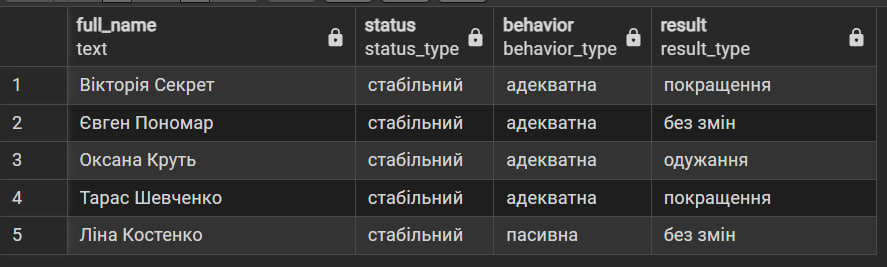

# Лабораторна робота №3

## Маніпулювання даними SQL (OLTP)

### SQL-скрипт(и)

INSERT INTO doctor (cabinet_id, section_id, first_name, last_name, post, salary, date_of_employment) VALUES  
(2, 2, 'Євген', 'Трохимович', 'Реабілітолог', 30000.00, '2021-01-12'),
(3, 2, 'Наталія', 'Довжиченко', 'Санітар', 22000.00, '2020-05-16'),
(1, 1, 'Олена', 'Коваленко', 'Черговий психіатр', 45000.00, '2018-03-15'),
(4, 3, 'Софія', 'Лисенко', 'Ерготерапевт', 32000.00, '2022-06-10'),
(7, 4, 'Ірина', 'Ткачук', 'Психотерапевт', 52000.00, '2019-09-01'),
(8, 4, 'Андрій', 'Бойко', 'Невролог', 42000.00, '2020-02-14');

SELECT  
  d.first_name || ' ' || d.last_name AS full_name,
  d.post,
  d.salary,
  date_of_employment,
  s.name AS section_name,
  c.number AS cabinet_number
FROM doctor d  
JOIN cabinet c ON d.cabinet_id = c.cabinet_id
JOIN section s ON d.section_id = s.section_id
WHERE s.name = 'Відділення для гострих станів' OR s.name = 'Відділення межових станів';

UPDATE patient
SET
  status = 'стабільний', 
  behavior = 'адекватна'
FROM site
WHERE patient.site_id = site.site_id AND number = 201;

SELECT
  p.first_name || ' ' || last_name as full_name,
  p.status, 
  p.behavior,
  s.number
FROM patient p
JOIN site s ON p.site_id = s.site_id
WHERE s.number = 201;

INSERT INTO clinical_protocol (patient_id, doctor_id, start_date, result) VALUES
(4, 4, '2026-03-12', 'покращення'),
(5, 5, '2026-03-14', 'без змін'),
(6, 6, '2026-03-15', 'одужання'),
(8, 8, '2026-03-20', 'покращення'),
(10, 9, '2026-03-25', 'без змін'),
(1, 7, '2026-03-26', 'летальний наслідок');

DELETE FROM patient p
USING clinical_protocol cp
WHERE p.patient_id = cp.patient_id 
  AND cp.result = 'летальний наслідок';

SELECT
  p.first_name || ' ' || last_name as full_name,
  p.status, 
  p.behavior,
  cp.result
FROM clinical_protocol cp
JOIN patient p ON p.patient_id = cp.patient_id;

