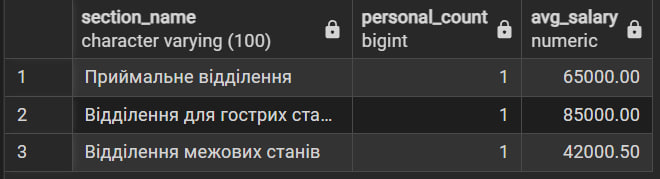
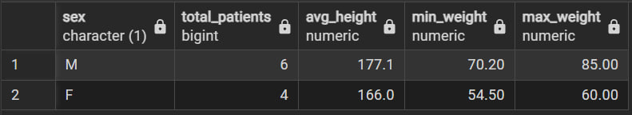
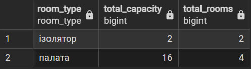
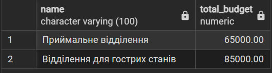
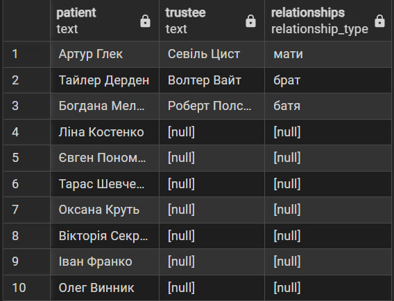
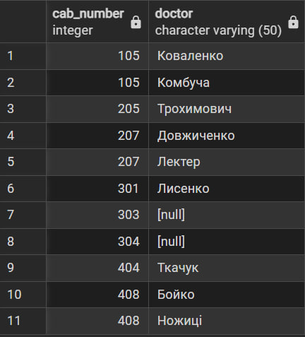
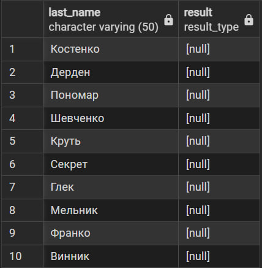
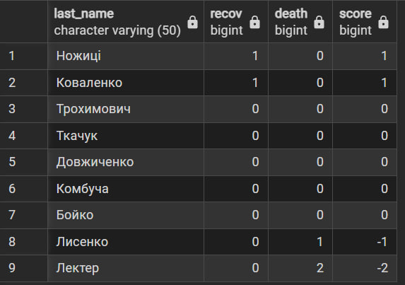
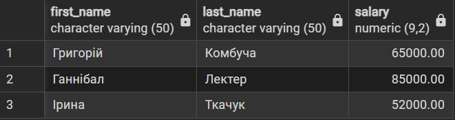
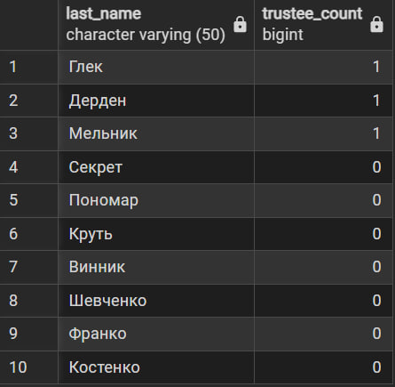

# Лабораторна робота №4

## Маніпулювання даними SQL (OLAP)

### SQL-скрипт(и)


```sql
-- 1.1) статистика персоналу по відділеннях
SELECT COUNT(*) AS total_outages
FROM outage_event;
```

```sql
-- 1.2) аналіз фізичних показників пацієнтів за статтю
SELECT sex, 
       COUNT(*) AS total_patients,
       ROUND(AVG(height), 1) AS avg_height,
       MIN(weight) AS min_weight,
       MAX(weight) AS max_weight
FROM patient
GROUP BY sex;
```

```sql
-- 1.3) загальна місткість лікані за типами приміщень
SELECT type AS room_type, 
       SUM(capacity) AS total_capacity,
       COUNT(site_id) AS total_rooms
FROM site
GROUP BY type;
```

```sql
-- 1.4) пошук відділеннь, де сумарна зарплата лікарів перевищує 50,000
SELECT s.name, SUM(d.salary) AS total_budget
FROM section s
JOIN doctor d ON s.section_id = d.section_id
GROUP BY s.name
HAVING SUM(d.salary) > 50000;
```


---

```sql
-- 2.1) пацієнти та їх опікуни (left)
SELECT p.first_name || ' ' || p.last_name AS patient, 
       t.first_name || ' ' || t.last_name AS trustee, 
       t.relationships
FROM patient p
LEFT JOIN trustee t ON p.patient_id = t.patient_id;
```

```sql
-- 2.2) кабінети та закріплені лікарі (right)
SELECT c.number AS cab_number, d.last_name AS doctor
FROM doctor d
RIGHT JOIN cabinet c ON d.cabinet_id = c.cabinet_id;
```

```sql
-- 2.3) повна перевірка пацієнтів та результатів лікування (full)
SELECT p.last_name, cp.result
FROM patient p
FULL JOIN clinical_protocol cp ON p.patient_id = cp.patient_id;
```


---

```sql
-- 3.1) рейтинг успішності лікарів (CTE)
WITH rank_stats AS (
  SELECT d.doctor_id, d.last_name,
    COUNT(CASE WHEN result = 'одужання' THEN 1 END) AS recov,
    COUNT(CASE WHEN result = 'летальний наслідок' THEN 1 END) AS death
  FROM doctor d LEFT JOIN clinical_protocol cp USING(doctor_id) 
  GROUP BY d.doctor_id, d.last_name
)
SELECT last_name, recov, death, (recov - death) AS score
FROM rank_stats ORDER BY score DESC;
```

```sql
-- 3.2) лікарі з зарплатою вище середньої (підзапит у WHERE)
SELECT first_name, last_name, salary
FROM doctor
WHERE salary > (SELECT AVG(salary) FROM doctor);
```

```sql
-- 3.3) кількість опікунів для кожного пацієнта (підзапит у SELECT)
SELECT p.last_name, 
       (SELECT COUNT(*) FROM trustee t WHERE t.patient_id = p.patient_id) AS trustee_count
FROM patient p;
```

