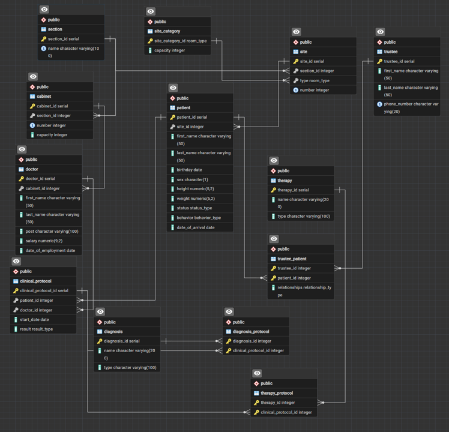

# Лабораторна робота №5: Нормалізація бази даних
**Тема:** Проектування та нормалізація структури БД психіатричної клініки

---

## 1. Початковий дизайн (ненормалізована форма)
На початковому етапі дані зберігалися у зведеній структурі, де були присутні неатомарні поля (списки діагнозів через кому), а також численні транзитивні залежності. Особисті дані пацієнтів та опікунів дублювалися, що призводило до аномалій оновлення та видалення.

---

## 2. Функціональні залежності (ФЗ)
1. **{patient_id, protocol_id} -> {result}**: Результат лікування залежить від конкретного випадку.
2. **patient_id -> {first_name, last_name, birthday}**: Особисті дані пацієнта функціонально залежать від його ID.
3. **site_id -> type -> capacity**: Місткість палати залежить від її типу, а не від унікального ID.
4. **doctor_id -> cabinet_id -> section_id**: Відділення лікаря залежить від кабінету, в якому він працює.

---

## 3. Процес нормалізації (Порівняльний аналіз)
### Крок 1. Усунення транзитивної залежності в палатах (Перехід до 3NF)
**БУЛО:** місткість (`capacity`) була прописана прямо в таблиці палат. Це змушувало дублювати дані для кожного приміщення одного типу.

SQL
```
CREATE TABLE site (
    site_id SERIAL PRIMARY KEY,
    number INT NOT NULL,
    type room_type NOT NULL,
    capacity INT NOT NULL, -- Транзитивна залежність
    CONSTRAINT check_enum_capacity CHECK (
        (type = 'ізолятор' AND capacity = 1) OR (type = 'палата' AND capacity = 4)
    )
);
```

**СТАЛО:** створено таблицю-довідник `site_category`. Тепер місткість контролюється централізовано через категорію.

SQL
```
CREATE TABLE site_category (
    site_category_id room_type PRIMARY KEY,
    capacity INT NOT NULL
);

CREATE TABLE site (
    site_id SERIAL PRIMARY KEY,
    type room_type REFERENCES site_category(site_category_id),
    number INT NOT NULL
);
```

### Крок 2. Оптимізація зв'язку лікарів та відділень (Усунення надлишковості)
**БУЛО:** лікар був прив'язаний і до кабінету, і до відділення одночасно, що створювало ризик суперечливих даних.

SQL
```
CREATE TABLE doctor (
    doctor_id SERIAL PRIMARY KEY,
    cabinet_id INT,
    section_id INT NOT NULL REFERENCES section(section_id),
    FOREIGN KEY (cabinet_id, section_id) REFERENCES cabinet(cabinet_id, section_id)
);
```

**СТАЛО:** поле `section_id` видалено. Тепер відділення визначається автоматично через кабінет лікаря, що гарантує цілісність.

SQL
```
CREATE TABLE doctor (
    doctor_id SERIAL PRIMARY KEY,
    cabinet_id INT REFERENCES cabinet(cabinet_id),
    first_name VARCHAR(50) NOT NULL,
    last_name VARCHAR(50) NOT NULL
);
```

### Крок 3. Рефакторинг зв'язку з опікунами (Усунення аномалій)
**БУЛО:** один опікун міг бути закріплений лише за одним пацієнтом (1:N). Дані опікуна дублювалися для реєстрації кількох підопічних.

SQL
```
CREATE TABLE trustee (
    trustee_id SERIAL PRIMARY KEY,
    patient_id INT NOT NULL REFERENCES patient(patient_id),
    first_name VARCHAR(50) NOT NULL,
    phone_number VARCHAR(20)
);
```

**СТАЛО:** впроваджено таблицю зв’язку Many-to-Many. Тепер один опікун може бути пов'язаний з багатьма пацієнтами без дублювання особистих даних.

SQL
```
CREATE TABLE trustee (
    trustee_id SERIAL PRIMARY KEY,
    first_name VARCHAR(50) NOT NULL,
    phone_number VARCHAR(20) UNIQUE
);

CREATE TABLE trustee_patient (
    trustee_id INT REFERENCES trustee(trustee_id),
    patient_id INT REFERENCES patient(patient_id),
    relationships relationship_type,
    PRIMARY KEY (trustee_id, patient_id)
);
```

---

## 4. ER-діаграма
Після проведення декомпозиції було сформовано фінальний DDL-скрипт, що відповідає вимогам **3NF**.



---

## 5. Перевірка цілісності та Висновки
Для перевірки роботи нормалізованої бази було виконано видалення пацієнтів із летальним наслідком.

**Результат запиту:**
Як видно на скріншоті результатів вибірки, після видалення пацієнта в таблиці протоколів лікування посилання на пацієнта приймає значення `[null]`. Це підтверджує коректну роботу обмеження `ON DELETE SET NULL`, що дозволяє зберігати медичну історію (протоколи) в анонімізованому вигляді навіть після вибуття пацієнта з активного обліку.

**Висновок:** у ході роботи базу даних було успішно нормалізовано, що дозволило мінімізувати надлишковість та повністю усунути аномалії оновлення та видалення даних.
