# Міграції бази даних (Flyway)
Цей файл документує послідовні зміни, внесені до схеми бази даних психіатричної клініки за допомогою SQL-міграцій Flyway.

## 1. Створення нової таблиці (Examination)
**Опис:**
Створено нову таблицю `examination` для фіксації результатів оглядів пацієнтів. Таблиця дозволяє зберігати час проведення огляду та текстові скарги, пов'язуючи їх з конкретним клінічним протоколом та лікарем.

**Зміни в SQL (`V5__create_examination_table.sql`):**
```
CREATE TABLE examination (
    examination_id SERIAL PRIMARY KEY,
    clinical_protocol_id INT NOT NULL REFERENCES clinical_protocol(clinical_protocol_id) ON DELETE CASCADE,
    doctor_id INT NOT NULL REFERENCES doctor(doctor_id),
    examination_time TIMESTAMP DEFAULT CURRENT_TIMESTAMP,
    complaints TEXT
);
```

---

## 2. Зміна існуючих таблиць (Додавання та Перейменування)
**Опис:**
1. **Додавання:** у таблицю `doctor` додано стовпець `specialization`. Після цього виконано автоматичне заповнення даних: спеціалізація лікаря встановлюється залежно від назви відділення, до якого належить його кабінет (наприклад, "Черговий лікар-психіатр" для Приймального відділення).
2. **Перейменування:** виконано серію перейменувань для покращення семантики та стандартизації назв у базі даних (наприклад, використання `room_number` замість загального `number`).

### Додавання стовпця та оновлення даних (`V2__add_column_to_doctor.sql`)

```
ALTER TABLE doctor ADD COLUMN specialization VARCHAR(100);

-- Логіка заповнення (фрагмент):
UPDATE doctor SET specialization = 'Черговий лікар-психіатр' 
FROM cabinet JOIN section ON cabinet.section_id = section.section_id 
WHERE doctor.cabinet_id = cabinet.cabinet_id AND section.name = 'Приймальне відділення';
```

### Перейменування стовпців (`V4__renaming_columns_in_tables.sql`)
- `patient`: `birthday` → `date_of_birth`
- `site` та `cabinet`: `number` → `room_number`
- `doctor`: `date_of_employment` → `hire_date`
- `diagnosis` та `therapy`: `type` → `category`

---

## 3. Видалення стовпця
**Опис:**
З моделі `patient` видалено поле `date_of_arrival`. Це рішення прийнято для оптимізації структури, оскільки дата прибуття пацієнта фіксується в таблиці клінічних протоколів, що дозволяє уникнути дублювання інформації.

**Зміни в SQL (`V3__delete_column_from_patient.sql`):**
```
ALTER TABLE patient DROP COLUMN date_of_arrival;
```

---

## 4. Налаштування та Перевірка роботи

Конфігурація Flyway та підключення до PostgreSQL визначені у файлі `application.properties`. Налаштування `ddl-auto=validate` гарантує, що Hibernate лише перевіряє схему, тоді як усі зміни вносяться виключно через SQL-міграції.

**Налаштування (`application.properties`):**
- `spring.flyway.baseline-on-migrate=true`
- `spring.jpa.hibernate.ddl-auto=validate`

**Результат виконання міграцій:**
При запуску додатка Flyway автоматично перевіряє стан бази даних та застосовує відсутні скрипти.

```
--- Підключення до бази даних (PostgreSQL) ---
Successfully applied 4 migrations to schema "public", now at version v5

--- Перевірка структури таблиць ---
Стовпець specialization у таблиці doctor: Існує
Стовпець date_of_birth у таблиці patient: Існує (успішно перейменовано)
Таблиця examination створена: true

--- Тестова вставка даних у нову таблицю ---
Створено новий огляд для протоколу №1:
{
  examination_id: 1,
  examination_time: 2026-03-15T10:00:00,
  complaints: 'Пацієнт скаржиться на порушення сну та підвищену тривожність'
}
```

Ці зміни підтверджують, що:
1. Система керування міграціями Flyway коректно застосовує зміни схеми.
2. Нові зв'язки та таблиці (як `examination`) успішно інтегровані.
3. Логіка оновлення даних при зміні схеми (Data Migration) працює без помилок.

## **5. Скріншоти**
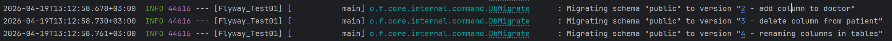


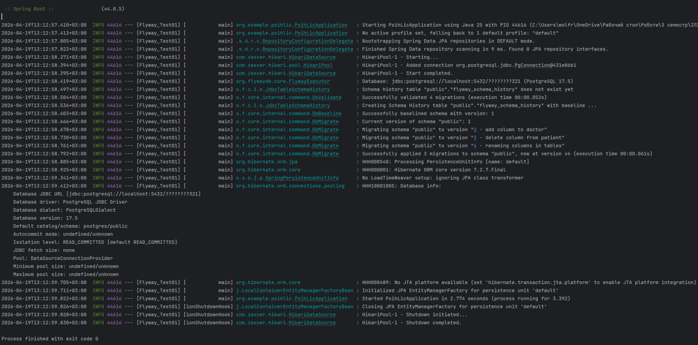


Ентіті до:
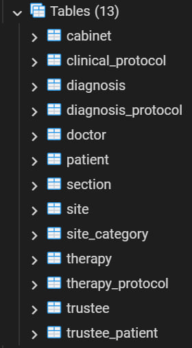


Ентіті після:
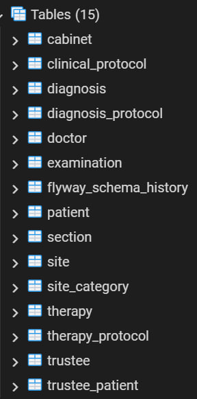


Доктор до:
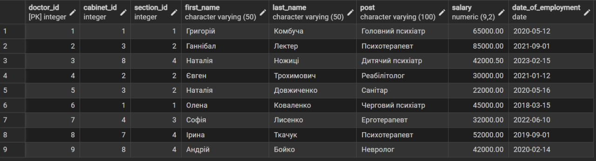


Пацієнт до:


Діагноз до:
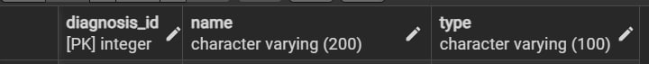


Клінічний протокол до:


Доктор після:
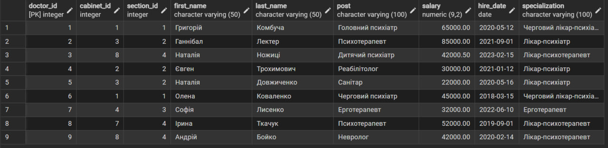


Пацієнт після:
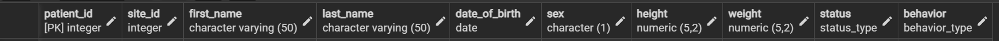


Діагноз після:
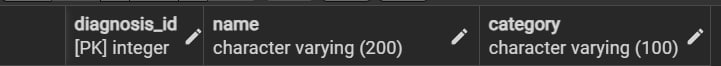


Клінічний протокол після:
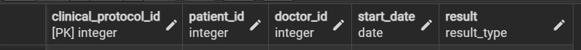


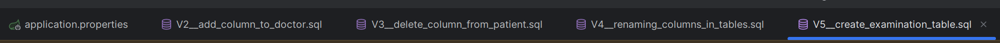


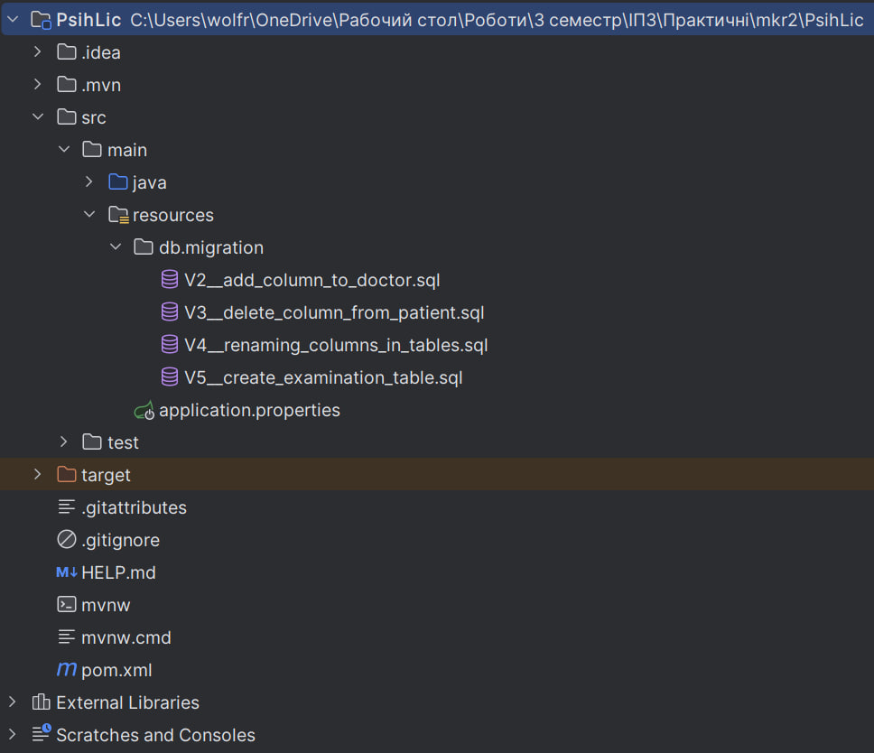

